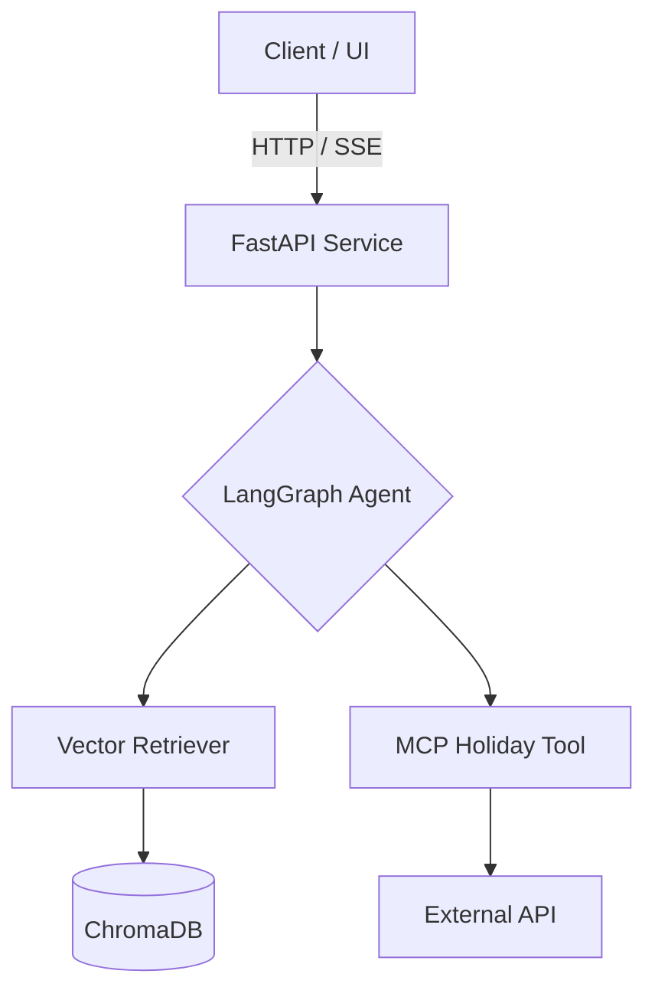

# 🌸 Blossom Banking AI Agent

Blossom Banking AI Agent is a **production-grade, agentic service** designed to assist Blossom Banking members and internal support staff with login and security-related questions.

The system is built using a **Retrieval-Augmented Generation (RAG)** architecture, ensuring all responses are grounded in official internal documentation, safe, and compliant with banking-grade reliability requirements.

---

## 🏗 System Architecture

The architecture emphasizes **modularity, observability, and resilience**:

* **FastAPI Layer** — Async API layer with SSE support
* **LangGraph Agent** — Orchestrates reasoning and tool invocation
* **ChromaDB Vector Store** — Persistent PDF-grounded knowledge
* **MCP Integration** — External context (federal holidays, weekend awareness)

### Architecture Diagram



---

## ⚙️ Configuration (Environment Variables)

Create a `.env` file or configure these variables in Railway / Docker:

| Variable               | Description                   | Default                  |
| ---------------------- | ----------------------------- | ------------------------ |
| `OPENAI_API_KEY`       | OpenAI API Key (**required**) | —                        |
| `CHAT_MODEL_NAME`      | Agent reasoning model         | `gpt-4o-mini`            |
| `EMBEDDING_MODEL_NAME` | Embedding model               | `text-embedding-3-small` |
| `CHROMA_PATH`          | ChromaDB persistence path     | `/app/chroma_db`         |
| `DATA_PATH`            | PDF knowledge base directory  | `/app/data`              |
| `PORT`                 | API service port              | `8000`                   |

---

## 🛡 Knowledge Base & Safety

### Source Fidelity

Only PDFs located in `/data` and explicitly whitelisted are ingested.

### Metadata Enrichment

Each vector chunk contains:

* Source filename
* Page number
* Semantic tags

### Anti-Hallucination Policy

**Retrieve-or-Fallback** strategy:

* Grounded content → answer with citations
* No grounding → safe redirection to official support

### Temporal Awareness

The agent is aware of:

* Current date
* Federal holidays
* Weekend support limitations

(via MCP tool)

---

## 🚀 Deployment & Resilience

### Railway-Ready Design

The system is hardened for Railway’s ephemeral filesystem and avoids common persistence failures such as:

```
sqlite3.Error: (code: 14) unable to open database file
```

### Key Strategies

* Persistent volume mounted at `/app/chroma_db`
* Non-root Docker execution with explicit permissions
* Lazy vector initialization during startup
* Warm-up invocation to remove cold-start latency

---

## 🔌 API Endpoints

| Endpoint       | Method | Description                          |
| -------------- | ------ | ------------------------------------ |
| `/chat`        | POST   | Standard synchronous chat            |
| `/chat/stream` | GET    | Server-Sent Events (token streaming) |
| `/health`      | GET    | Liveness & readiness probe           |

---

## 📈 Observability & SLA

The service exposes real-time telemetry via HTTP headers:

* `X-Process-Time-Ms` — Request processing duration
* `X-SLA-Status`

  * `MET` if p95 ≤ 5s
  * `BREACHED` otherwise

This enables straightforward integration with external monitoring systems.

---

## 💻 Getting Started

### Local Development

```bash
export OPENAI_API_KEY=your_secret_key
export PYTHONPATH=.

uvicorn src.main:app --host 0.0.0.0 --port 8000 --reload
```

### Docker

```bash
docker build -t blossom-agent .
docker run -p 8000:8000 --env-file .env blossom-agent
```

---

## 🛠 Troubleshooting

| Symptom               | Cause                      | Resolution                                 |
| --------------------- | -------------------------- | ------------------------------------------ |
| `ChromaDB (code: 14)` | Permission or volume issue | Verify volume mount and Docker permissions |
| `MCP Ready: false`    | MCP server failure         | Check logs and dependencies                |
| `401 Unauthorized`    | Invalid API key            | Verify `OPENAI_API_KEY`                    |
